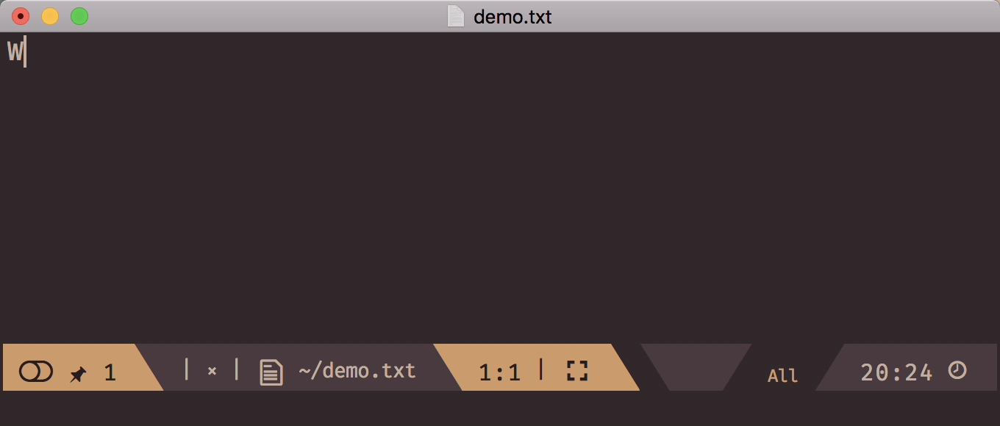

 

**emacs-powerthesaurus** is a simple plugin to integrate Emacs with amazing [powerthesaurus.org](https://www.powerthesaurus.org).

## Installation

**emacs-powerthesaurus** is available on MELPA. You can install it using the following command:

<kbd>M-x package-install [RET] powerthesaurus [RET]</kbd>

## How to use

**emacs-powerthesaurus** defines a single interactive function, namely `powerthesaurus-lookup-dwim`, which asks for the type of the query and tries to infer the term that the user wants to retrieve synonyns, antonyms, etc for.

Particularly:
* If the region is active, this command assumes that results (e.g., synonyms, antonyms, etc) for the selected text should be downloaded from [powerthesaurus.org](https://www.powerthesaurus.org).
* If the region is not active and point is located at a word, it assumes that the word under point should be searched for.
* In any other case, it will directly prompt the user for the phrase to search.

At this point, the following types of query are supported:
* synonyms,
* antonyms,
* related terms,
* definitions, and
* sentences.

Finally, `powerthesaurus-lookup-dwim` can either replace the original phrase with one of the fetched results, insert a selected result at point or
display the list of all results in a pop-up buffer. By default, results of "synonyms", "antonyms" and "related" queries will be inserted in place whereas results of
sentences and definitions are displayed separately, although one can force either of these two behaviors through the prefix argument (i.e., <kbd>C-u ...<kbd>).

For the sake of convenience, the following commands are also provided which wrap around `powerthesaurus-lookup-dwim` and provide a quick way to perform a specific type of query:
* `powerthesaurus-lookup-synonyms-dwim`
* `powerthesaurus-lookup-antonyms-dwim`
* `powerthesaurus-lookup-related-dwim`
* `powerthesaurus-lookup-definitions-dwim`
* `powerthesaurus-lookup-sentences-dwim`

Additionally, for non-interactive use, the function `powerthesaurus-lookup` is provided.

## Old API
The following subsections describe the now obsolete API before version 0.2, which is still provided for the time being although use of it should 

### How to use

**emacs-powerthesaurus** defines three interactive functions:
* `powerthesaurus-lookup-word`
* `powerthesaurus-lookup-word-at-point`
* `powerthesaurus-lookup-word-dwim`

If you have any active selection, `powerthesaurus-lookup-word` fetches selected text at [powerthesaurus.org](https://www.powerthesaurus.org) and gives you a list of synonyms to replace it with. Without any selection it asks you for the input first, and insert selected synonyms at point.

`powerthesaurus-lookup-word-at-point` finds a word at point (according to the current mode settings), fetches it at [powerthesaurus.org](https://www.powerthesaurus.org), and also replaces it with the selected synonym.

`powerthesaurus-lookup-word-dwim` combines these two functions into one. It tries to infer whatever user wants to look up. If there is an active selection that will be the choice. Otherwise, it checks if there any word at point and fetches that word. And if there is nothing appropriate, it asks the user to provide a word.

### Demo

## Changelog

### Version 0.2.0

* Revamp the package's overall architecture,
  introducing a new, more compact API and commands while better
  organizing its internals.
* Extend mechanism allowing different types of queries, namely
  "synonyms, "antonyms", "related", "definitions", and "sentences".
* Support queries involving terms that consist of multiple words (e.g.,
  "give up").
* Fix Github issues #13, #14, #15 and #17.
