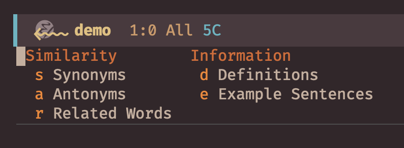
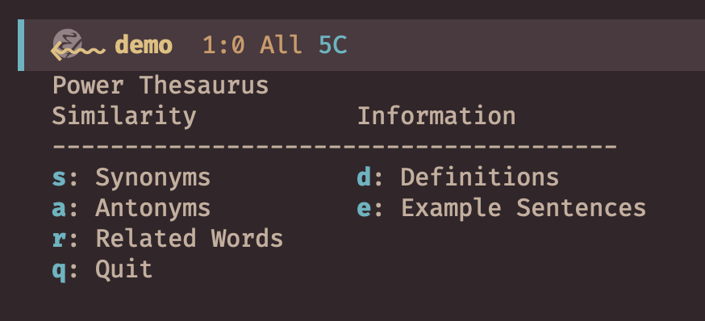
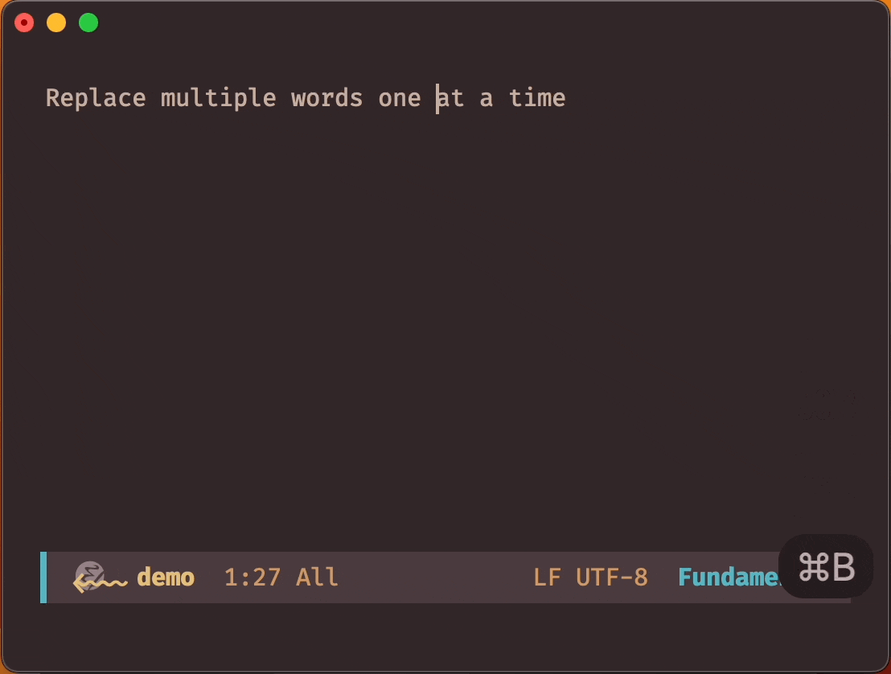
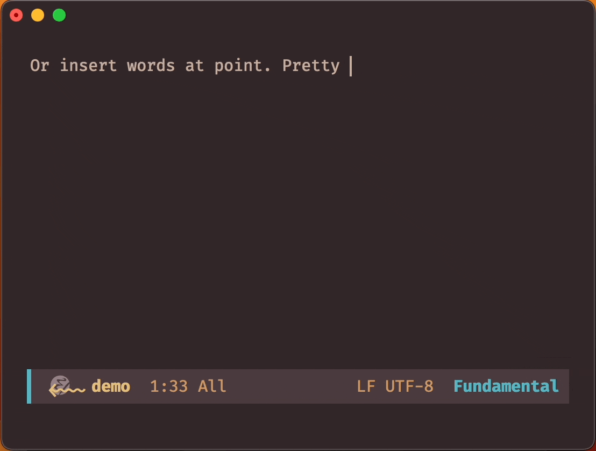
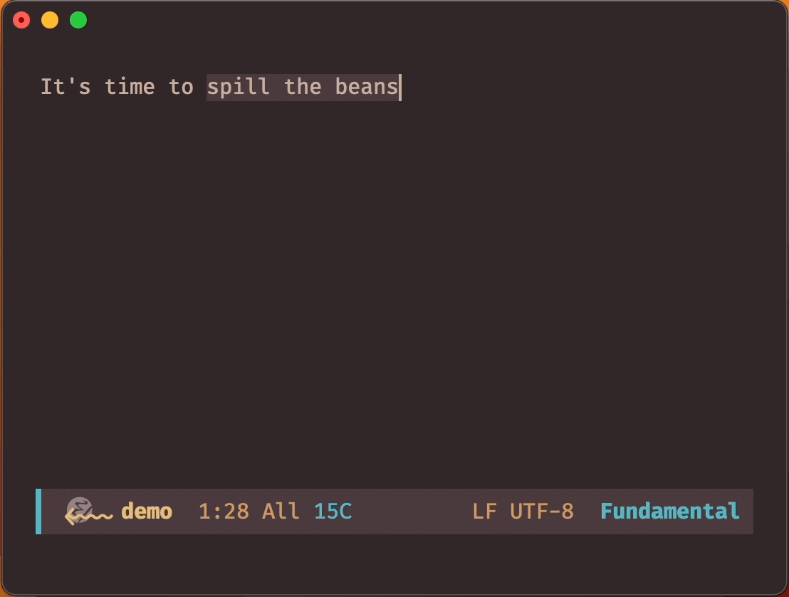
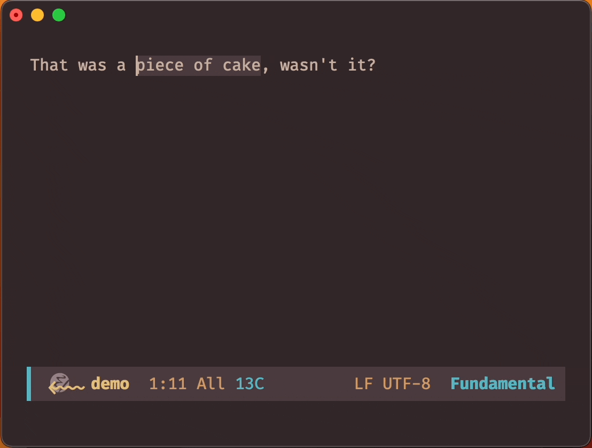

 

**emacs-powerthesaurus** is a plugin that integrates Emacs with the amazing [powerthesaurus.org](https://www.powerthesaurus.org) service for finding synonyms, antonyms, and related terms.

## Installation

Install **emacs-powerthesaurus** from MELPA with the following command:

<kbd>M-x package-install [RET] powerthesaurus [RET]</kbd>

## Usage

`powerthesaurus-lookup-dwim` is the main interactive function, and it retrieves results from [powerthesaurus.org](https://www.powerthesaurus.org). It determines the search term based on the active region or the word at point and prompts the user to select the type of query to perform (synonyms, antonyms, related terms, definitions, or sentences).

By default, synonyms, antonyms, and related terms replace the original term, while sentences and definitions display in a separate pop-up buffer. To override this behavior, use the prefix argument (e.g., <kbd>C-u M-x powerthesaurus-lookup-dwim</kbd>).

For quick access to specific query types, use these commands:

* `powerthesaurus-lookup-synonyms-dwim`
* `powerthesaurus-lookup-antonyms-dwim`
* `powerthesaurus-lookup-related-dwim`
* `powerthesaurus-lookup-definitions-dwim`
* `powerthesaurus-lookup-sentences-dwim`

For non-interactive use, call the powerthesaurus-lookup function.

Additionally, it defines [transient](https://github.com/magit/transient)

and [hydra](https://github.com/abo-abo/hydra) interfaces

### Demo

## Deprecated API

The previous API (prior to version 0.2) is still available but not recommended. It consists of three interactive functions:

* `powerthesaurus-lookup-word`
* `powerthesaurus-lookup-word-at-point`
* `powerthesaurus-lookup-word-dwim`

## Changelog

### Version 0.3.0
* Migrate from parsing HTML of the page to the use of the API.

### Version 0.2.2
* Remove redundant headers in request messages to server that potentially cause
  failure to parse received candidates (Github issue #16).

### Version 0.2.1
* Fix regression involving result sorting during selection.
* Fix minor bugs.

### Version 0.2.0

* Revamp the package's overall architecture.
* Extend mechanism allowing different types of queries, namely
  synonyms, antonyms, related terms, definitions, and sentences.
* Support queries involving terms that consist of multiple words (e.g.,
  "give up").
* Fix Github issues #13, #14, #15 and #17.

## Acknowledgements

I want to give a huge shoutout to the creators of powerthesaurus.org for creating
such an amazing tool.

Also, kudos to the authors of [alfred-powerthesaurus](https://github.com/clarencecastillo/alfred-powerthesaurus) who figured out internal APIs and whose work I shamelessly copied.
